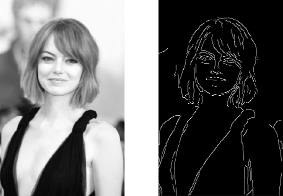

# Edge Detection Methods
Edge detection mechanisms in image understanding are fundamental techniques used to identify and extract boundaries or edges between objects and regions within an image. These edges represent significant changes in intensity or color and play a crucial role in various image processing tasks such as object recognition, segmentation, and feature extraction.

