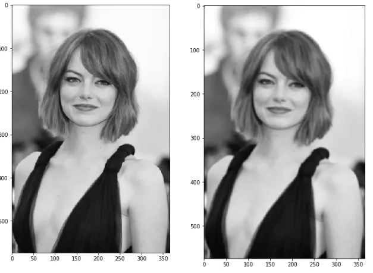
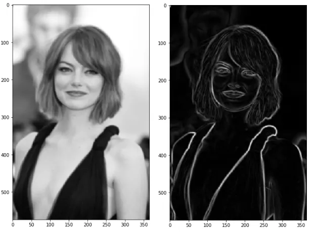
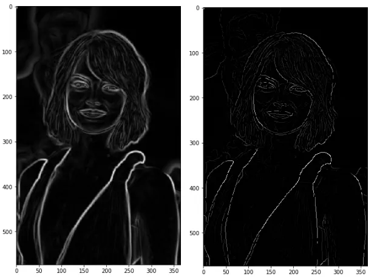
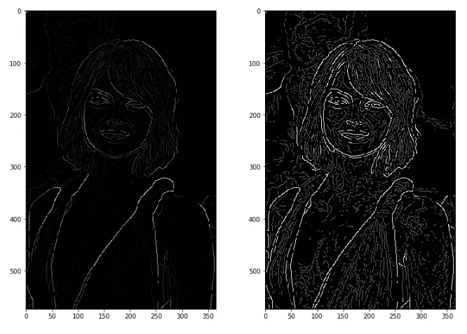
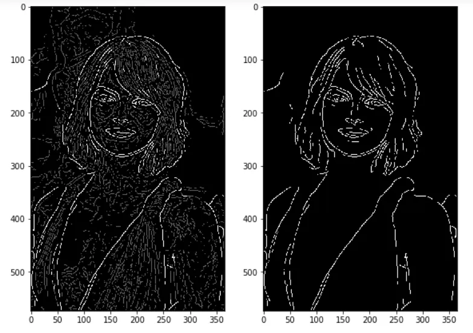

# Canny Edge Detection

source: https://towardsdatascience.com/canny-edge-detection-step-by-step-in-python-computer-vision-b49c3a2d8123

Multi-stage edge detection algorithm involving Gaussian smoothing, gradient computation, non-maximum suppression, and hysteresis thresholding. Canny edge detector is known for its robustness and ability to detect edges accurately while minimizing false positives.

The Canny Edge Detector is a widely used edge detection algorithm in computer vision and image processing. It was developed by John F. Canny in 1986 and is known for its robustness, accuracy, and ability to detect edges while minimizing false positives. The Canny Edge Detector consists of several stages, each designed to address specific aspects of edge detection:

1. **Gaussian Smoothing**:
   - The input image is convolved with a Gaussian kernel to reduce noise and suppress small fluctuations in pixel intensity. Gaussian smoothing helps to create a smoothed version of the image, which makes the subsequent edge detection more reliable.

   

2. **Gradient Computation**:
   - The smoothed image is then convolved with derivative kernels (typically Sobel kernels) to compute the gradient magnitude and orientation at each pixel. The gradient magnitude represents the rate of change of pixel intensity, while the gradient orientation indicates the direction of the steepest change.

   

3. **Non-maximum Suppression**:
   - Non-maximum suppression is applied to the gradient magnitude image to thin out the edges and preserve only the local maxima in the gradient direction. This stage ensures that only the most significant edges are retained while suppressing weaker or redundant edge responses.

   

4. **Double Thresholding**:
   - Double thresholding is used to classify edge pixels into three categories: strong edges, weak edges, and non-edges. Two threshold values, high and low, are specified. If the gradient magnitude of a pixel is above the high threshold, it is classified as a strong edge. If it falls below the low threshold, it is classified as a non-edge. Pixels with gradient magnitudes between the two thresholds are classified as weak edges.

   

5. **Edge Tracking by Hysteresis**:
   - Weak edge pixels that are connected to strong edge pixels are retained, while isolated weak edge pixels are suppressed. This is achieved through a process called edge tracking by hysteresis, where weak edge pixels are recursively traced along the edges of strong edge pixels. If a weak edge pixel is connected to a strong edge pixel, it is considered part of the edge; otherwise, it is discarded.

   

The output of the Canny Edge Detector is a binary image where edge pixels are represented by white pixels and non-edge pixels are represented by black pixels. The algorithm produces thin, continuous, and well-localized edges that accurately capture the boundaries of objects in the image.

The Canny Edge Detector is widely used in various computer vision tasks, including object detection, image segmentation, feature extraction, and image registration, due to its effectiveness and versatility. However, selecting appropriate threshold values and kernel sizes can be challenging and may require experimentation or parameter tuning based on the specific characteristics of the input images.

